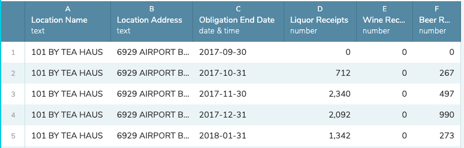

# Notes about Data Workbench

Workbench is based on Python's [pandas]() module, which means you can leverage pandas to do things that Workbench can't do natively.

This is a collection of some of those things.

## How it works

- In Workbench, create a new step and choose the [Python](http://help.workbenchdata.com/en/articles/1484226-python-editor) module.
- Define a function called `process` that accepts a workbench table (as a `pd.DataFrame`) and returns the same. You can use the following packages:
  - math
  - pd ([Pandas](https://pandas.pydata.org/pandas-docs/stable/reference/index.html))
  - np ([numpy](https://docs.scipy.org/doc/numpy/reference/routines.html))

```python
def process(table):
    # Do your thing here
    return table
```

Your pandas dataframe object is called `table`, so you can reference columns as `table['tablename']` or `table.tablename`.

## Examples

### Zfill values

You can't define a datatype for a column before import, so sometimes text fields like ZIP codes are imported as numbers and drop the leading zero, i.e., `02101` in Massachusets becomes `2101`.

This uses pandas' [zfill](https://pandas.pydata.org/pandas-docs/stable/reference/api/pandas.Series.str.zfill.html) to put zeros back at the beginning if they are missing.

```python
def process(table):
    table['ZIP'] = table['ZIP'].astype(str).str.zfill(5)
    return table
```

I've found this also useful with education data that uses school numbers that start with zero and Census bureau data with GEOid columns.

## Reshaping with melt

There is a "Reshape" function in Workbench, but it only allows you to reshape from Wide to Long on a single column, where sometimes you need to reshape on more than one.

In this example we start with five columns of data:



But we want each "Receipt" value on its own row, but keep it's `Location Name`, `Location Address` and `Obligation End Date` on each row. Like this:


Workbench will only allow us to "keep" a single column on a reshape from wide to long, but we can use pandas [melt](https://pandas.pydata.org/pandas-docs/stable/reference/api/pandas.melt.html) function to reshape the data:

```python
def process(table):
    table = table.melt(id_vars=[
      'Location Name',
      'Location Address',
      'Obligation End Date'
      ], value_vars=[
        'Liquor Receipts',
        'Wine Receipts',
        'Beer Receipts'
        ],
 var_name='Alcohol Type', value_name='Amount')
    return table
```
