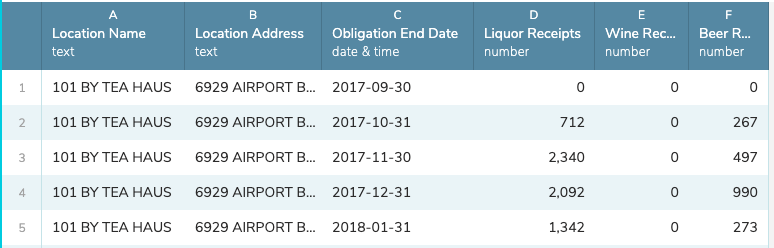
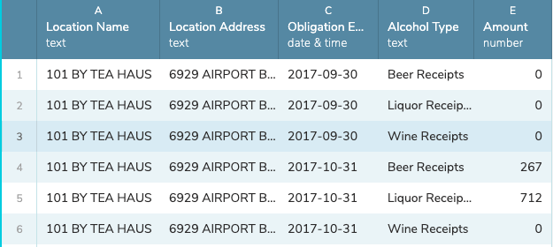

# Reshaping with melt

There is a "Reshape" function in Workbench, but it only allows you to reshape from Wide to Long on a single column, where sometimes you need to reshape on more than one.

In this example we start with five columns of data:



But we want each "Receipt" value on its own row, but keep it's `Location Name`, `Location Address` and `Obligation End Date` on each row. Like this:



Workbench will only allow us to "keep" a single column on a reshape from wide to long, but we can the **Formula** function in Workbench and the **python** setting to use the pandas-based [melt](https://pandas.pydata.org/pandas-docs/stable/reference/api/pandas.melt.html) function to reshape the data:

```python
def process(table):
    table = table.melt(id_vars=[
      'Location Name',
      'Location Address',
      'Obligation End Date'
    ], value_vars=[
      'Liquor Receipts',
      'Wine Receipts',
      'Beer Receipts'
    ],
    var_name='Alcohol Type', value_name='Amount')
    return table
```

There is a Workbench workflow [example of this here](https://app.workbenchdata.com/workflows/38208/).
